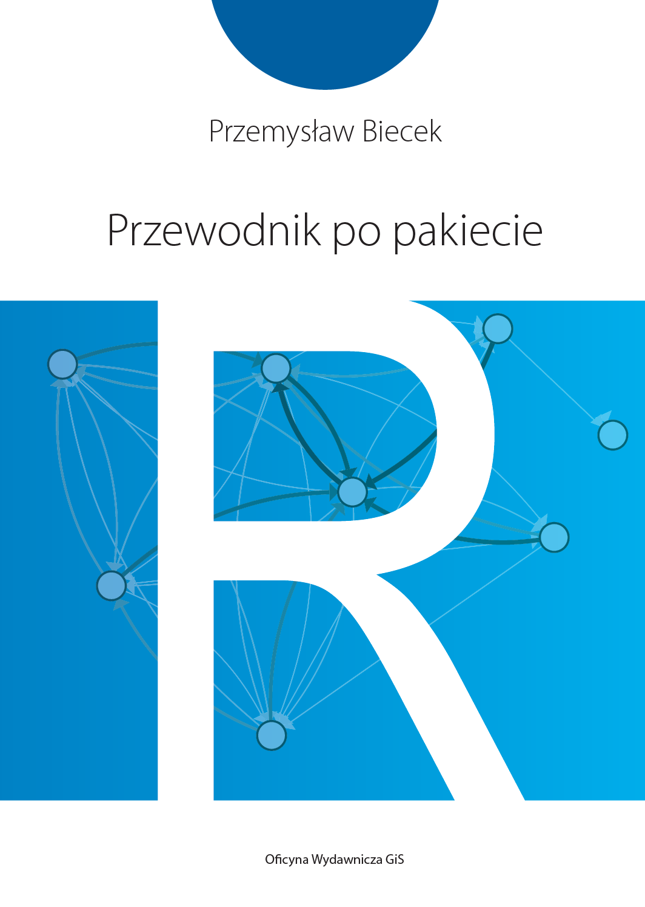

```{r setup, include=FALSE}
knitr::opts_chunk$set(echo = TRUE)
```

# About


Translation of the first 80 pages from [,,Przewodnik po pakiecie R''](http://pbiecek.github.io/Przewodnik/).

by

<b>Krzysztof Trajkowski</b>.

<br/>

<center></center>

<br/>

More information: http://biecek.pl/R/

```{r child = 'Guide_Ch_1_Introduction.Rmd'}
```

```{r child = 'Guide_Ch_1_Sec_1_1.Rmd'}
```

```{r child = 'Guide_Ch_1_Sec_1_2.Rmd'}
```

```{r child = 'Guide_Ch_1_Sec_1_3.Rmd'}
```

```{r child = 'Guide_Ch_1_Sec_1_4.Rmd'}
```

```{r child = 'Guide_Ch_2_Basics.Rmd'}
```

```{r child = 'Guide_Ch_2_Sec_2_1.Rmd'}
```

```{r child = 'Guide_Ch_2_Sec_2_2.Rmd'}
```

```{r child = 'Guide_Ch_2_Sec_2_3.Rmd'}
```

```{r child = 'Guide_Ch_2_Sec_2_4.Rmd'}
```

```{r child = 'Guide_Ch_2_Sec_2_5.Rmd'}
```

```{r child = 'Guide_Ch_2_Sec_2_6.Rmd'}
```

# References {-}